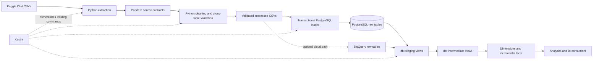

# Olist Analytics Engineering Warehouse

An end-to-end analytics engineering project built from the public Olist
Brazilian e-commerce dataset. It turns source CSV files into tested dimensional
models through a Python ingestion boundary, PostgreSQL or BigQuery, dbt, and a
locally reproducible Kestra workflow.

The project is designed around a practical question: how can a small commerce
warehouse remain understandable while still handling validation, incremental
updates, safe retries, and operational failures explicitly?

## What the project demonstrates

- source and cross-table data contracts with Pandera;
- atomic, audited PostgreSQL publication using bulk `COPY` and staging tables;
- table-specific upsert, append/deduplicate, and snapshot strategies;
- dbt sources, staging models, intermediate models, dimensional marts,
  contracts, generic tests, singular tests, and unit tests;
- incremental fact maintenance that propagates late changes to old orders;
- PostgreSQL for inexpensive local development and a retained BigQuery target;
- containerized execution and Kestra orchestration of the same application
  commands used manually;
- CI split between fast checks, credential-free PostgreSQL integration tests,
  and container construction.

## Architecture



Responsibilities are intentionally separated:

- **Python** owns file acquisition, programmatic validation, normalization,
  batch identity, and physical raw-table publication.
- **dbt** owns warehouse SQL, dependency management, model contracts,
  dimensional modeling, and analytical quality rules.
- **Kestra** owns task order, retries, timeouts, parameters, and execution logs;
  it contains no business transformation logic.

PostgreSQL is the supported local runtime. BigQuery remains an optional
deployment target and is not required by normal development or CI.

## Data flow and failure guarantees

Each ingestion attempt validates all nine Olist datasets before database
publication. It then assigns a batch UUID, ingestion timestamp, source
fingerprint, and deterministic record hashes.

The PostgreSQL loader copies every table into a uniquely named staging table
and publishes the complete batch in one transaction. An advisory lock prevents
overlapping writers to the same raw schema. If any table fails, PostgreSQL
rolls back the full batch and the previously coherent raw layer remains
available. A separately committed audit ledger records `running`, `succeeded`,
or `failed` even when publication rolls back.

Loading behavior follows source semantics:

| Tables | Strategy | Safe rerun behavior |
|---|---|---|
| customers, orders, order items, payments, products, sellers | Upsert by business key | Inserts new rows; updates only changed hashes |
| reviews | Append and deduplicate by record hash | Exact observations are not duplicated |
| geolocation, category translation | Transactional snapshot replacement | Replaces the delivered reference snapshot without dropping the target table |

Absence from an incremental file is not interpreted as deletion. Deletions
would require explicit tombstones or a declared complete-snapshot
reconciliation process.

## Warehouse model

```text
raw sources
  -> stg_customers, stg_orders, stg_order_items, ...
      -> int_orders_enriched and reusable order/payment/review/geography models
          -> dim_customers
          -> dim_products
          -> dim_sellers
          -> fct_orders
          -> fct_order_items
```

The marts use natural source keys because those keys are stable within this
single-source warehouse and no cross-system identity resolution is needed.

- `fct_orders`: one row per `order_id`; order lifecycle, delivery, payment,
  item, and review measures.
- `fct_order_items`: one row per `(order_id, order_item_id)`; additive item and
  freight amounts with customer, product, and seller references.
- `dim_customers`: one row per `customer_id`. `customer_unique_id` represents
  the buyer identity and may occur more than once because Olist customer IDs
  are order-address identities.
- `dim_products`: one row per `product_id` with translated category attributes.
- `dim_sellers`: one row per `seller_id` with normalized geography.

Both facts are incremental `merge` models. Their `warehouse_updated_at`
watermark is derived from every source row that can affect the fact, so a late
correction to a historical order is eligible for update. Intermediate models
are views, so this reduces fact writes but does not claim to eliminate all
upstream scans.

## Quick start with Docker

Prerequisites: Docker with Compose v2 and Kaggle API credentials if the source
files have not already been downloaded.

```bash
git clone <repository-url>
cd olist_data_warehouse
cp .env.example .env
```

Set the passwords and credentials in `.env`. On Linux also set:

```dotenv
LOCAL_UID=1000
LOCAL_GID=1000
OLIST_PROJECT_DIR=/absolute/path/to/olist_data_warehouse
```

Use `id -u` and `id -g` rather than assuming both IDs are `1000`.

Build the application image and start PostgreSQL:

```bash
docker compose build pipeline
docker compose up -d postgres
```

Run the pipeline manually:

```bash
docker compose run --rm --no-deps pipeline \
  olist-extract --out-dir /app/data/raw

docker compose run --rm --no-deps pipeline \
  olist-transform \
  --raw-data-dir /app/data/raw \
  --processed-data-dir /app/data/processed

docker compose run --rm pipeline \
  olist-load-postgres --processed-dir /app/data/processed

docker compose run --rm pipeline \
  dbt build \
  --project-dir /app/dbt \
  --profiles-dir /app/dbt \
  --target postgres_dev
```

Or start Kestra, deploy the version-controlled flows, and run
`olist.pipeline.olist_postgres_pipeline` from <http://localhost:8080>:

```bash
./scripts/deploy_kestra_flows.sh
```

Routine executions should leave `run_extraction=false`; enable it only when
the static Kaggle files need to be refreshed. The flow serializes concurrent
runs because its tasks share local bind-mounted data directories.

## Local development without containers

The project requires Python 3.11 and uses
[uv](https://docs.astral.sh/uv/) for dependency and environment management.

```bash
uv python install 3.11.15
uv sync --locked --group dev --group docs
cp .env.example .env
docker compose up -d postgres
```

CLI commands can then be invoked with `uv run`, for example:

```bash
uv run olist-check-postgres
uv run olist-transform --raw-data-dir data/raw --processed-data-dir data/processed
uv run olist-load-postgres --processed-dir data/processed
uv run dbt build --project-dir dbt --profiles-dir dbt --target postgres_dev
```

## Testing and CI

Run the credential-free checks:

```bash
uv lock --check
uv run ruff check src tests
uv run mypy src tests
uv run pytest -m "not postgres"
uv run dbt parse --project-dir dbt --profiles-dir dbt --target postgres_dev
uv run mkdocs build --strict
```

Run database integration tests against the local PostgreSQL container:

```bash
RUN_POSTGRES_TESTS=1 uv run pytest -m postgres -v
```

Integration tests use isolated schemas and verify transactional rollback,
idempotent CLI loading, durable audit state, table identity preservation, and
late-update propagation through incremental dbt facts.

GitHub Actions runs three independent jobs on pull requests: static and unit
checks, PostgreSQL/dbt integration tests using an ephemeral service container,
and an application-image build. Normal CI requires no BigQuery credentials and
incurs no cloud warehouse cost.

## Repository map

```text
src/olist_dw/       Python package: configuration, contracts, ETL, loaders, CLIs
dbt/                dbt sources, staging/intermediate models, marts, tests, seeds
kestra/             local Kestra configuration and version-controlled flows
tests/              unit, PostgreSQL integration, CLI, and dbt integration tests
scripts/            container smoke test and Kestra flow deployment helpers
docs/               engineering guides and architecture decisions
compose.yaml        PostgreSQL, disposable pipeline runtime, and Kestra services
Dockerfile          reproducible Python and dbt application image
notebooks/          exploratory analysis retained from the original project
DA_report/          static copy of the original Looker Studio report
```

The former hand-ordered `sql/` transformation tree was retired. dbt is now the
single warehouse transformation system, making dependencies, contracts, tests,
and adapter behavior explicit.

## Design decisions and limitations

- The Olist files are static, but the loader models them as an initial snapshot
  followed by possible delta batches so update and retry behavior is testable.
- No SCD Type 2 dimension was added because the source does not provide a
  trustworthy history of changing customer, product, or seller attributes.
- A backfill is currently a deliberate replay of source batches followed by a
  dbt rebuild; date-range backfills are not claimed because the source has no
  extract partitions or reliable source update timestamp.
- BigQuery adapter compatibility is retained, but credentialed BigQuery
  integration tests are not run in normal CI. Its Python raw loader performs a
  metadata-bearing full-snapshot bootstrap; PostgreSQL remains the implemented
  path for incremental publication and a durable ingestion audit ledger.
- Kestra uses the local Docker socket for a simple single-user portfolio
  runtime. This grants broad host control and must be replaced by a restricted
  worker or external execution platform before any shared deployment.
- Kestra is not permanently scheduled because the source is a static public
  dataset and the local control plane is not intended to run continuously.

Detailed guides are in [`docs/`](docs/index.md), including the
[PostgreSQL ingestion design](docs/engineering/etl/postgres_ingestion.md),
[Docker workflow](docs/engineering/runtime/docker.md),
[Kestra behavior](docs/engineering/orchestration/kestra.md), and the recorded
[architecture decisions](docs/engineering/decisions/001-postgres-raw-loading-strategy.md).

## Analytical output

The original exploratory notebook and static Looker Studio report remain as
examples of downstream consumption:

- [`notebooks/Brazilian_Ecommerce_Analysis.ipynb`](notebooks/Brazilian_Ecommerce_Analysis.ipynb)
- [`DA_report/Olist_Marketplace_Report.pdf`](DA_report/Olist_Marketplace_Report.pdf)

They predate the current dbt mart layer and should be treated as historical
analysis artifacts rather than the warehouse's executable semantic contract.
